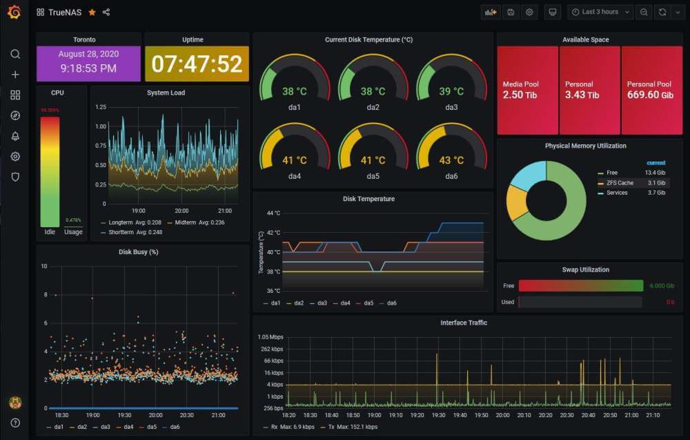
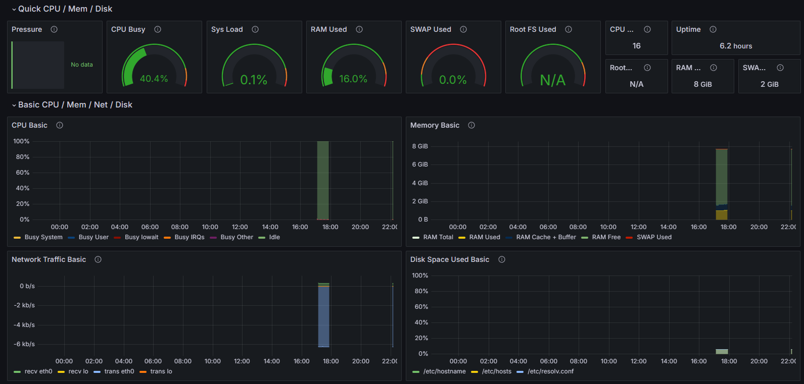

# Inzicht in Systemen en Metrics met Grafana

*[Mark Bijker, oktober 2024.](https://github.com/hanaim-devops/blog-MarkBijker)*

## Inleiding

Monitoring van systemen en applicaties is essentieel voor het efficiënt beheren van infrastructuren in de moderne DevOps-omgeving. Of het nu gaat om servers, netwerken of containers, inzicht krijgen in de prestatiegegevens kan het verschil maken tussen een soepel functionerend systeem en urenlang troubleshooting. Hier komt Grafana om de hoek kijken, een krachtige open-source tool die visuele weergaven van metrics biedt om deze eenvoudig te monitoren.

In dit onderzoek wordt de kracht van Grafana als monitoringtool verkend binnen een DevOps-context. Grafana is een open-source platform dat data visualiseert vanuit verschillende bronnen (Grafana Labs, 2022), zoals Prometheus en Loki. Dit onderzoek zal uitleggen hoe Grafana kan worden ingezet voor het monitoren van systeembronnen, inclusief hands-on voorbeelden van configuraties en gebruik. Specifieke onderdelen zoals codevoorbeelden, configuraties en grafieken worden besproken om een praktisch inzicht te geven in hoe Grafana in te zetten.

## Wat is Grafana?

Grafana is een open-source analytics- en monitoringplatform, ontworpen om real-time dashboards te leveren van verschillende datastromen. Zoals uitgelegd in de officiële documentatie van Grafana (Grafana Labs, z.d.), blinkt het platform uit in zijn mogelijkheden om gegevens uit verschillende bronnen te combineren, zoals databases, monitoringtools, en meer. Gebruikers kunnen aangepaste dashboards maken om data-inzichten te vergaren die specifiek zijn voor hun infrastructuur of applicaties.
## Waarom Grafana voor Monitoring?

Een van de belangrijkste voordelen van Grafana is de mogelijkheid om complexe metrics op een begrijpelijke en visueel aantrekkelijke manier weer te geven. Zoals beschreven in een blog door Walker (2022), biedt Grafana krachtige dashboards die gebruikers in staat stellen om cruciale datapatronen te analyseren. Het ondersteunt verschillende datasources, waaronder Prometheus, en stelt gebruikers in staat om in te zoomen op specifieke tijdstippen en gebeurtenissen (Grafana Labs, 2022).

Laten we eens kijken naar de belangrijkste redenen waarom Grafana een goede keuze is voor monitoring:

- Aangepaste dashboards: Grafana biedt de mogelijkheid om volledig gepersonaliseerde dashboards te creëren die je systeem- en applicatiestatistieken nauwkeurig weergeven.
- Waarschuwingen: Door eenvoudig waarschuwingen in te stellen, kun je snel op de hoogte worden gebracht van problemen of afwijkingen in je systeem. Bijvoorbeeld als het CPU-gebruik boven een bepaalde drempel komt.
- Datasources combineren: Grafana ondersteunt niet alleen Prometheus, maar ook tal van andere datastromen zoals Elasticsearch, InfluxDB, en MySQL, wat het een veelzijdige oplossing maakt voor teams met meerdere monitoringbehoeften.

## Configuratie: Grafana met Prometheus en Node Exporter

Nu we begrijpen wat Grafana, Prometheus en Node Exporter zijn, laten we deze tools samen configureren om monitoring in te stellen voor een Linux-server. In dit voorbeeld gebruiken we een standaard meegeleverd dashboard om snel van start te gaan.

### Stap 1: Node Exporter Installeren

Om systeemmetrics van een Linux-server te verzamelen, moeten we Node Exporter installeren. Dit is een Prometheus-exporter die statistieken verzamelt over de serverhardware en het besturingssysteem. Installeer Node Exporter met behulp van onderstaande link:

[Node Exporter Installeren](https://prometheus.io/download/#:~:text=556adf78030370c461d059c8b4375e4296472a3af6036d217c979f68bcd5cb4e-,node_exporter,-Exporter%20for%20machine)

### Stap 2: Prometheus Installeren

Vervolgens installeren we Prometheus, een monitoring tool die systeemmetrics verzamelt en beschikbaar stelt voor visualisatie in Grafana. Zoals vermeld in de officiële documentatie van Prometheus, is dit een krachtige tool die metrics efficiënt opslaat en verwerkt (Prometheus.io, z.d.). Deze stap zorgt ervoor dat de verzamelde gegevens vanuit Node Exporter naar Prometheus worden gestuurd. Gebruik de volgende link om Prometheus te installeren:

[Prometheus Installeren](https://prometheus.io/download/#:~:text=amd64-,prometheus,-The%20Prometheus%20monitoring)

### Stap 3: Datasource Configureren in Grafana

Nadat Prometheus is geïnstalleerd, moeten we deze configureren als datasource in Grafana:

- Log in op de Grafana-interface.
- Navigeer naar Configuration > Data Sources.
- Klik op Add data source en selecteer Prometheus.
- Vul het URL-veld in met de locatie van je Prometheus-server (bijvoorbeeld <http://localhost:9090> als Prometheus lokaal draait).
- Klik op **Save & Test** om de verbinding te verifiëren.

### Stap 4: Dashboard Importeren

Voor de visuele weergave van de systeemmetrics kunnen we een standaard dashboard importeren in Grafana. Dit wordt gedaan door [het JSON-bestand](dashboard.json) van het dashboard handmatig toe te voegen:

- Ga in Grafana naar Dashboards > Manage.
- Klik op Import en plak de JSON-inhoud van het standaard Node Exporter dashboard in het veld.
- Selecteer de juiste Prometheus-datasource en klik op Import om het dashboard toe te voegen.
  
Na deze stappen heb je een volledig functionele monitoring setup met Grafana, waarbij systeemmetrics worden verzameld door Node Exporter, opgeslagen door Prometheus, en visueel weergegeven in een gebruiksvriendelijk dashboard.

## Conclusie

Met Grafana heb je de mogelijkheid om complexe systeem- en applicatiemetrics inzichtelijk te maken door middel van krachtige, aanpasbare dashboards. In combinatie met Prometheus en Node Exporter kun je real-time data verzamelen en analyseren, waardoor je altijd een volledig beeld hebt van de prestaties van je infrastructuur.

De flexibiliteit van Grafana, gecombineerd met de nauwkeurige dataverzameling van Prometheus, maakt dit duo ideaal voor DevOps-teams die op zoek zijn naar een oplossing voor monitoring. Of je nu kleine serveromgevingen of grote, gedistribueerde systemen beheert, Grafana biedt de tools om metrics effectief te visualiseren en problemen proactief aan te pakken.

## Bronnen
- Walker, J. (2022, February 8). Geraadpleegd 10 oktober 2024 van _[What is Grafana and When Should You Use It? How-To Geek.](https://www.howtogeek.com/devops/what-is-grafana-and-when-should-you-use-it/)_ 
- Grafana Labs. (2022, January 19). Geraadpleegd op 10 oktober 2024, van _[A beginner's guide to network monitoring with Grafana and Prometheus](https://grafana.com/blog/2022/01/19/a-beginners-guide-to-network-monitoring-with-grafana-and-prometheus/ )._
- Grafana Node Exporter Dashboard (2024, May 18). Geraadpleegd 10 oktober 2024, van [Grafana Node Exporter Full](https://grafana.com/grafana/dashboards/1860-node-exporter-full/).
- Prometheus.io. (z.d.). Geraadpleegd op 10 oktober 2024, van _[Introduction to Prometheus](https://prometheus.io/docs/introduction/overview/)_
- Grafana Labs. (z.d.). Introduction to Grafana. Geraadpleegd op 10 oktober 2024, van _[About Grafana](https://grafana.com/docs/grafana/latest/introduction/)_
- GrafanaResearch (Repository waarin dit onderzoek is uitgevoerd) (2024, October) Geraadpleegd 10 oktober 2024 op _[GrafanaResearch](https://github.com/MarkBijker/GrafanaResearch)._
